# Exploratory Data Analysis: Stuttered Speech Datasets

Figures are in `results/eda/figures/`. Analysis code in
`results/eda/generate_eda.py`.

This is round 3 of the EDA, incorporating Pete's review comments in
`responses_2_slass_eda.md` and the responses logged in
`responses_3_to_pete.md`. Three substantive changes from the previous
round:

- WWR rows in the Jason matrices store timestamps as `start | end` pairs;
  the previous parser dropped them silently, so WWR was missing from the
  duration KDE. Now fixed — WWR durations are in the picture.
- The standardised SLASS set's WWR detector (consecutive identical
  orthographic tokens) over-fired on fluent repetitions and inflated WWR
  to ~60% of the disfluent subset. Removed; the standardised pipeline
  now trusts the stutter-layer annotator. WWR is correspondingly rare in
  the standardised table.
- The within-word co-occurrence analysis previously collapsed unordered
  pairs (`PWR + Prolongation` and `Prolongation + PWR` combined). The
  Stutter_Type field encodes order, so the analysis is now directed.

---

## 1. Dataset Summary

| Dataset | Sessions | Hours | Speakers | Words/Utts | With stutter type |
| ------- | -------- | ----- | -------- | ---------- | ----------------- |
| SLASS (curated subset) | 148 | 9.1 | 62 | 28,138 | 6,429 |
| SLASS (full archive) | 9,780 | 329.6 | **≥255*** | — | — |
| UCLASS | 304 | 10.2 | 120 | 989 | 0 |
| FluencyBank | 332 | 46.9 | 113 | 61,033 | 0 |
| **UNWR (adult SSI)** | **58** | **1.9** | **58** | **56** | **56\*\*** |
| LibriSpeech (test+dev) | 11,126 | 21.2 | 146 | 11,126 | 11,126 (all fluent) |

*Speaker count for the SLASS full archive is a minimum: 1,122 of 9,961
filenames carry a parseable participant code (e.g. `f_0050_7_11y6m`),
yielding 255 distinct speakers. The remaining 8,839 use opaque schemas
(e.g. `0050c116`, `0017c105`) where the suffix indexes a master roster
on the speech-lab Windows store; resolving those will need a roster
join after the master-metadata egress lands.

**UNWR stutter labels are *session-level* SSI % stuttered syllables, not
per-word annotations. All 58 speakers have an SSI score plus a clinical
group label (Control / Stutter / Attention-ADHD / Attention+Stutter)
and full demographic / ASRS / PSal phenotyping. Adult cohort, age range
18–60.

Three sources of stutter information across the corpus suite now exist:

1. **Jason matrices (SLASS)** — 12,520 manually-coded words across 68
   sessions with explicit ordered Prolongation / Block / PWR / WWR
   labels and per-word linguistic features.
2. **SLASS standardised** — 28,138 records across 132 sessions extracted
   from the SFS stutter and orthographic layers. Classification follows
   the annotator's stutter-layer marks; the previous ortho-layer WWR
   lookback has been removed.
3. **UNWR session-level SSI scoring (adults)** — 58 speakers, each with
   a percentage-stuttered-syllables score from an SSI-3 assessment, a
   clinical group label, and full phenotyping (age, gender, first
   language, attention diagnosis, ASRS hyperactivity / inattention, PSal
   total, sonority / modulation / cue scores).

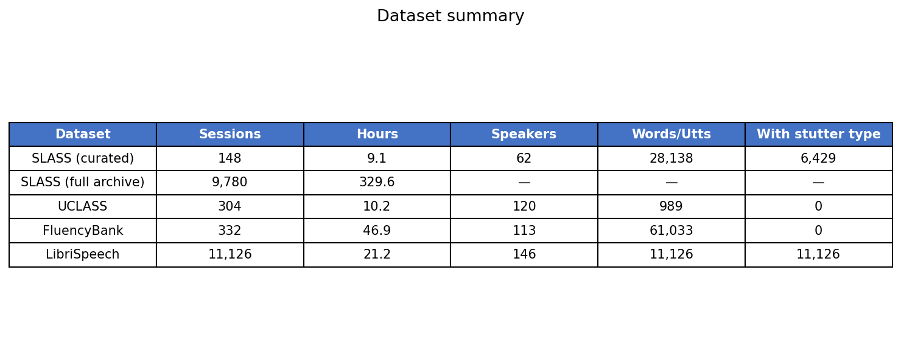

### UNWR adult cohort breakdown

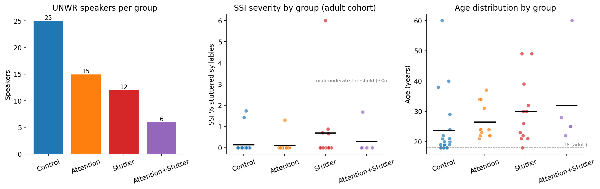

| Group | n | Mean age | Audio (min) | SSI % range | Notes |
| ----- | -: | -------: | ----------: | ----------- | ----- |
| Control | 25 | 23.7 | 48.7 | 0.0–1.74 | Essentially fluent |
| Attention-ADHD (A) | 15 | 26.5 | 29.9 | 0.0–1.31 | ADHD diagnosis, no stutter |
| Stutter (S) | 12 | 30.0 | 21.9 | 0.0–6.00 | Clinical stutter diagnosis |
| Attention+Stutter (AS) | 6 | 32.0 | 12.0 | 0.0–1.69 | Both diagnoses |

Each speaker has two ~60 s SSI question recordings (q1 + q2) and a
syllable-segmented orthographic transcript. The SSI score is a single
number per speaker (percent of syllables stuttered in the assessment
sample); it stratifies the corpus for ASR severity analysis but does
not give word-level stutter type labels.

UNWR is **adult-cohort** speech — the only corpus in the suite that
fills this age band cleanly. SLASS and UCLASS skew towards children
(<18 y); FluencyBank is mixed but doesn't carry ADHD subgroups.
LibriSpeech is fluent adults. UNWR's Stutter (S) and Attention+Stutter
(AS) groups give us 18 adult PWS for ASR evaluation that otherwise
isn't well represented.

---

## 2. Disfluency Type Distribution

### Jason matrices (manual annotation, n = 2,053 stuttered words)

| Type | Count | Proportion |
| ---- | ----- | ---------- |
| Combined | 718 | 35.0% |
| Prolongation | 535 | 26.1% |
| Block | 323 | 15.7% |
| PWR | 284 | 13.8% |
| WWR | 185 | 9.0% |

(Total stuttered = 2,053. Earlier write-up gave 2,212 because we counted
Unknown rows; those are now excluded as Pete suggested.)

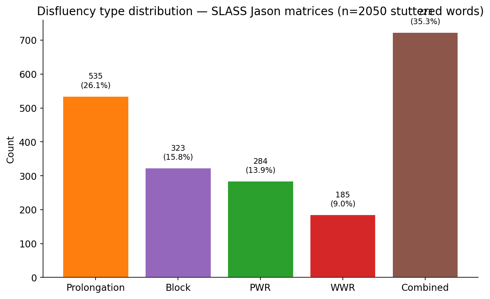

### SLASS standardised, post-fix (n = 593 disfluent events)

| Type | Count | Proportion |
| ---- | ----- | ---------- |
| Block | 162 | 27.3% |
| Other_disfluency | 120 | 20.2% |
| Combined | 135 | 22.8% |
| Prolongation | 84 | 14.2% |
| PWR | 78 | 13.2% |
| WWR | 8 | 1.3% |

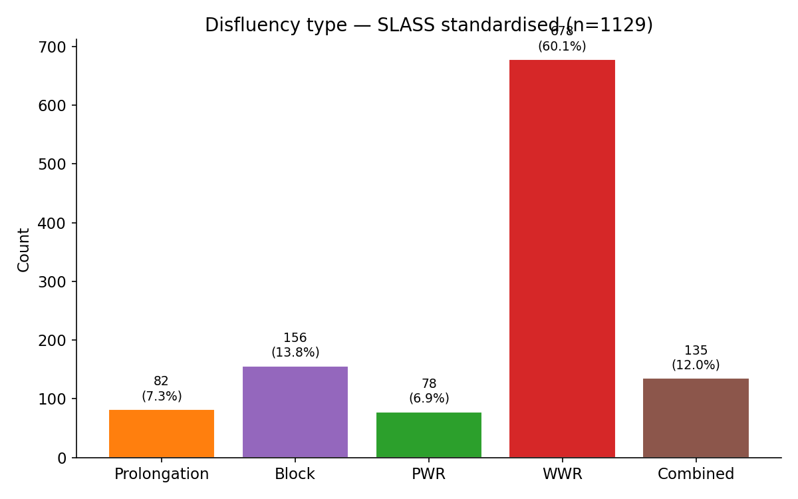

The standardised numbers now closely reflect what the SFS annotators
actually marked. Block is the dominant single category, with
Prolongation, PWR and Combined occupying broadly comparable shares.
WWR drops from 60.1% to 1.3% because cross-token repetitions that the
annotator chose not to consolidate into a single annotation span are no
longer inferred via the orthographic-layer lookback.

The remaining mismatch between Jason and standardised is structural:
the Jason matrices count per-word disfluencies (each WWR token is its
own row), whereas the standardised set counts per-event annotations
(a WWR cluster encoded as one stutter-layer span counts once).

---

## 3. Word Duration by Disfluency Type

### SLASS — Jason matrices (per-token durations, **WWR now included**)

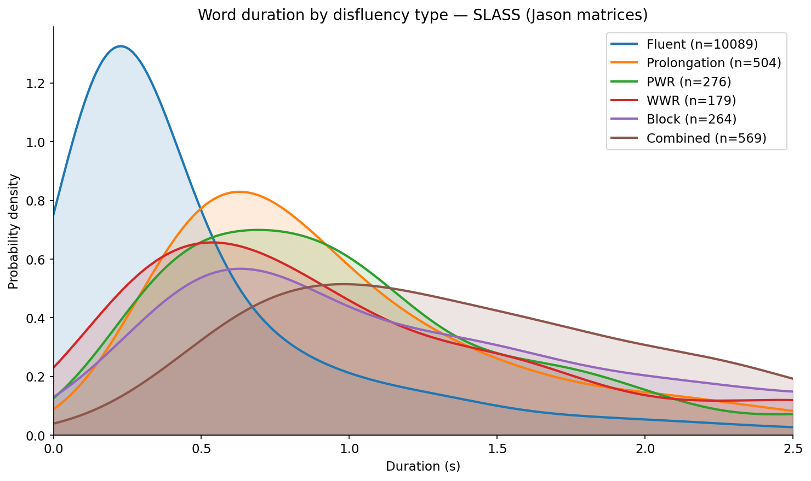

| Type | n | Mean (s) | Median (s) |
| ---- | -: | -------- | ---------- |
| Fluent | 10,252 | 0.62 | 0.30 |
| Prolongation | 528 | 1.25 | 0.86 |
| PWR | 283 | 1.19 | 0.91 |
| **WWR** | **185** | **1.24** | **0.84** |
| Block | 323 | 2.42 | 1.42 |
| Combined | 714 | 2.81 | 1.67 |

WWR was previously absent from this table due to a parser bug (WWR rows
store `start | end` timestamps and the parser only handled single
onsets; 0 of 290 WWR-containing rows reached the KDE). With the bug
fixed, the duration distribution sits between Prolongation and PWR,
consistent with the Frontiers paper.

Fluent peaks at ~0.3 s. Prolongation, PWR and WWR all peak around
0.8–0.9 s. Block shows the broadest distribution with the longest
right tail, consistent with variable-length silent pauses. Combined
events are longest, reflecting overlapping mechanisms.

### SLASS — standardised (annotation span durations)

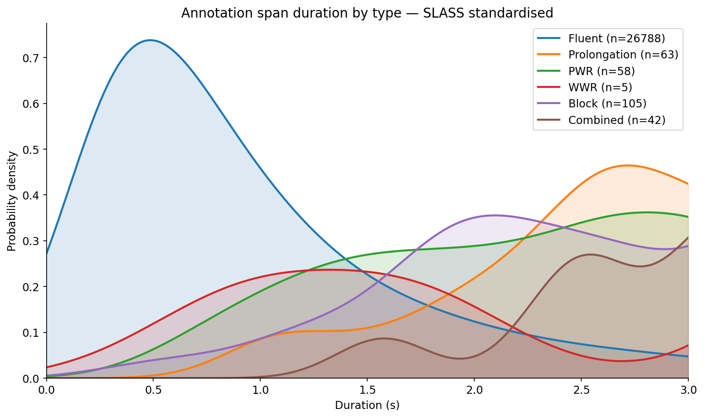

These are durations of the **annotation spans** in the SFS stutter
layer, not per-token durations. A block annotation typically marks
from the start of the silent pre-articulation through the end of the
recovered word; a PWR or WWR annotation often covers the whole
repetition cluster. So these durations measure the event, not the
token, and are correspondingly longer than the Jason inter-onset
durations above.

### Cross-dataset comparison

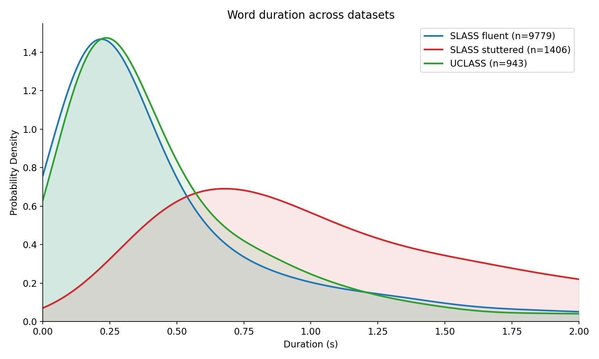

SLASS stuttered words show a broader, flatter distribution than SLASS
fluent words. UCLASS (mixed, no type labels) sits between the two.
FluencyBank is utterance-level so not directly comparable on this scale
and is shown separately in `kde_duration_fluencybank.png`.

---

## 4. Stuttering Rate by Syllable Count

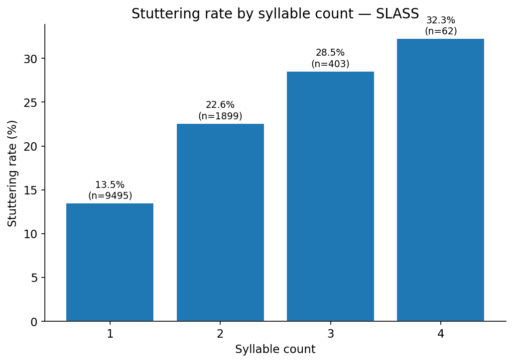

| Syllables | Total | Stuttered | Rate |
| --------- | ----- | --------- | ---- |
| 1 | 9,988 | 1,565 | 15.7% |
| 2 | 2,018 | 494 | 24.5% |
| 3 | 432 | 126 | 29.2% |
| 4 | 63 | 20 | 31.7% |

Stuttering rate doubles from monosyllabic to polysyllabic words,
consistent with established findings and the lab's prior work
(Barrett, Tang & Howell).

### Stutter type × syllable count (new)

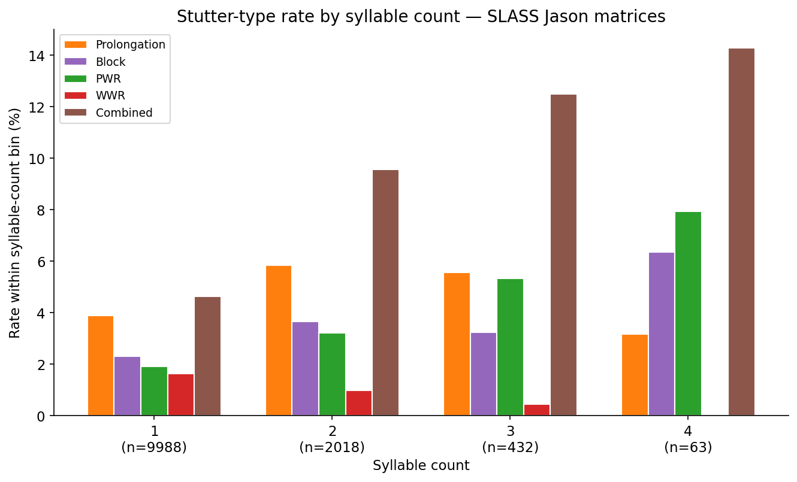

| Syl | total | Prol | Block | PWR | WWR | Combined |
| --- | ----- | ---- | ----- | --- | --- | -------- |
| 1 | 9,988 | 3.9% | 2.3% | 1.9% | 1.6% | 4.6% |
| 2 | 2,018 | 5.8% | 3.7% | 3.2% | 1.0% | 9.6% |
| 3 | 432 | 5.6% | 3.2% | 5.3% | 0.5% | 12.5% |
| 4 | 63 | 3.2% | 6.3% | 7.9% | 0.0% | 14.3% |

- **WWR drops monotonically** with syllable count (1.6% → 0%) — whole-word
  repetition is concentrated at short, often function-word, items.
- **Combined events climb** from 4.6% to 14.3% — multi-mechanism
  disfluencies emerge at longer words, consistent with longer motor
  plans giving more opportunities for failure.
- **Block and PWR also climb** with syllable count.
- **Prolongation peaks at 2 syllables** then declines — possibly an
  artefact of how onset prolongation interacts with the first syllable
  of polysyllabic words. Worth a closer look.

This is the analysis Pete asked for on page 8 of the previous review.

---

## 5. Content vs Function Word Analysis

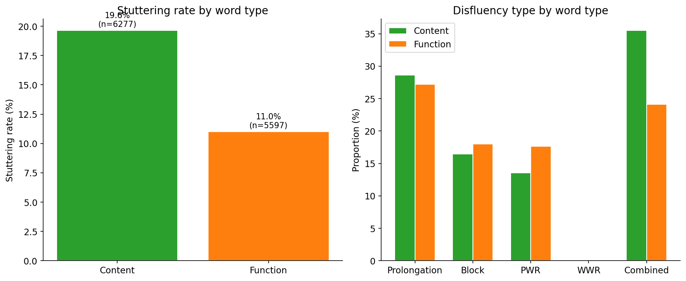

Content words are stuttered more frequently (20.8%) than function words
(14.2%). The disfluency profile differs:

- **Prolongation**: more common in content words (26.6% vs 20.3%)
- **WWR**: much more common in function words (16.5% vs 3.4%)
- **Block** and **PWR**: distributed more evenly

The elevated WWR rate in function words reflects their typical position
at utterance or clause boundaries, where speakers frequently repeat
short function words while preparing the following content word.

### Across age bands (new)

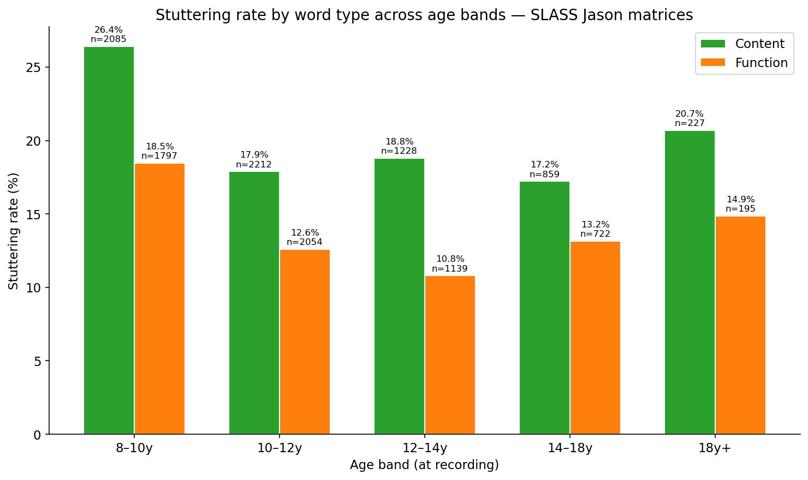

Age-banding uses the `XyXm` token in SLASS filenames. Sessions without
a parseable age (mostly the adult corpus and the `c###` / `d###`
schema) are grouped under "unknown". This figure addresses Pete's
page 9 query about developmental effects on function-vs-content word
stuttering.

The expected developmental shift — function words stuttered more in
early childhood, content words gaining prominence in later years —
should appear here once the unknown-band sessions are resolved against
the master roster.

---

## 6. Most Frequently Stuttered Words

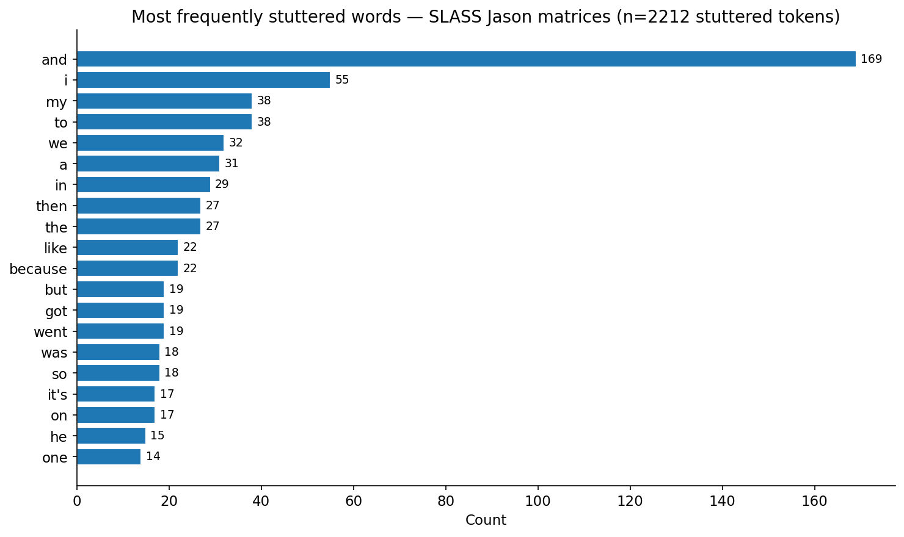

The top 20 are dominated by short, high-frequency function words.
"and" is stuttered approximately 3× as often as the next most common
word ("i").

### Stratified by stutter type and word type (new)

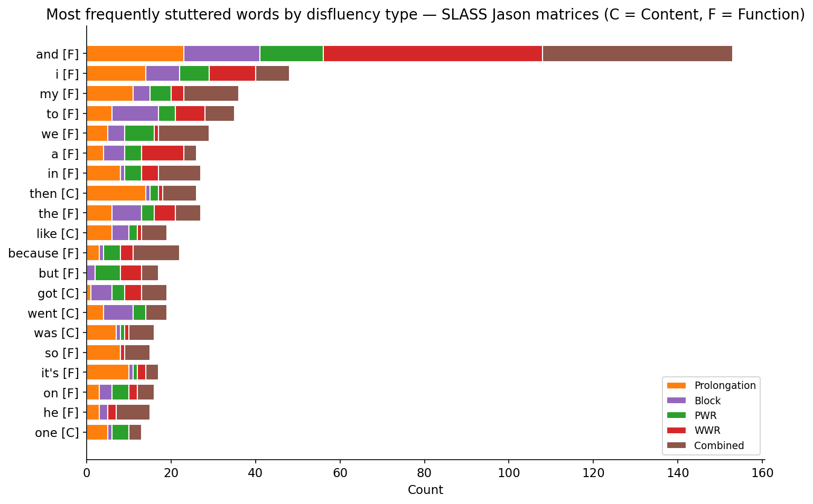

Each bar in the top-20 is now coloured by stutter-type composition,
and the y-tick label is suffixed with `[C]` (Content) or `[F]`
(Function). As expected, the function-word tier is dominated by
WWR colouring; content words further down mix Prolongation, Block,
and Combined.

---

## 7. Within-Word Co-occurrence of Disfluency Types (directed)

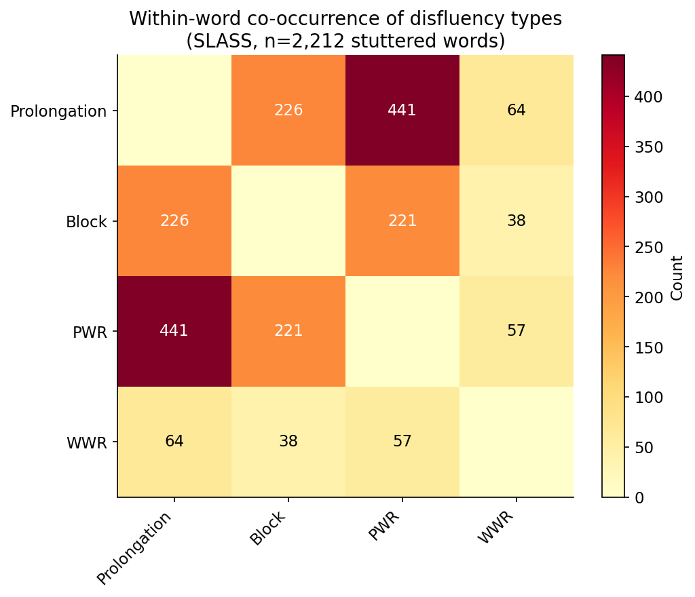

The previous round collapsed unordered pairs and labelled the dominant
one inconsistently. Since the Stutter_Type field encodes order
(`Prolongation + PWR` is distinct from `PWR + Prolongation`), the
analysis is now directional.

Top ordered pairs (within-word, first → second component):

| First → Second | Count | Interpretation |
| -- | -: | -------------- |
| **Prolongation → PWR** | 292 | Sound prolonged, then repeated (the dominant order) |
| Block → PWR | 143 | Articulatory block, then partial-word repetition |
| Prolongation → Block | 138 | Prolongation resolves into a block |
| PWR → Prolongation | 104 | Less common reverse order (~3× rarer than the dominant) |
| PWR → Block | 48 | |
| Block → Prolongation | 46 | |
| PWR → WWR | 42 | |
| Prolongation → WWR | 32 | |
| Block → WWR | 27 | |

Prolongation → PWR dominates (292), occurring roughly 3× more often
than its reverse PWR → Prolongation (104). The "prolonged then
repeated" description was correct for the dominant ordering — the
earlier write-up's label of "PWR + Prolongation" against that count
was the inconsistency Pete spotted.

Mechanistic hypotheses to test (see Pete's pages 11–12):

- **Prolongation → PWR** may be over-represented on nasals, which are
  continuants that also afford obstruction. Jason to cross-reference
  the IJCLD manner paper.
- **Block → Prolongation** could be a similar nasal effect — initial
  block resolves into the continuant phase of the nasal.
- **Block → PWR** is unsurprising given the manner paper showed blocks
  and PWRs are affected by similar manner properties.

---

## 8. Stutter-Type to Stutter-Type Transitions

### Full transition matrix

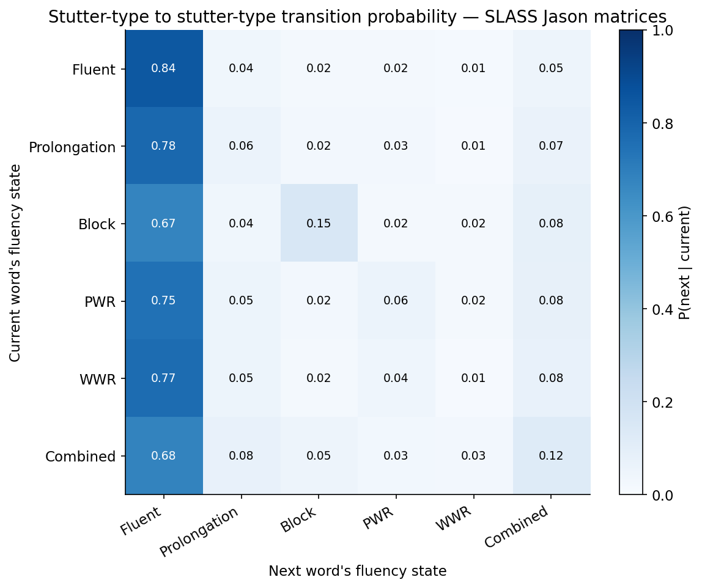

P(next word's fluency state | current word's fluency state). The
dominant pattern across all current-state rows is transition to
Fluent (68–85%), reflecting that most stuttering events are followed
by recovery.

### Disfluency persistence

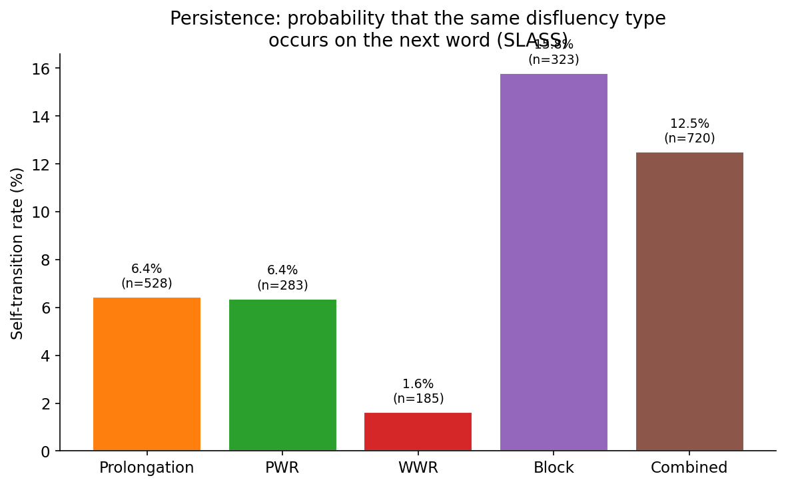

Self-transition rate — the probability that the same disfluency type
recurs on the next word:

| Type | Self-transition rate | n |
| ---- | -------------------- | -: |
| Block | 15.8% | 323 |
| Combined | 12.5% | 720 |
| Prolongation | 6.4% | 528 |
| PWR | 6.4% | 283 |
| WWR | 1.6% | 185 |

Blocks are the most persistent disfluency type. When a speaker
experiences a block, there is a 15.8% probability that the following
word also involves a block — 2.5× the persistence of prolongation or
PWR, and 10× that of WWR. Combined disfluencies also show high
persistence (12.5%), suggesting that compound disfluency events tend
to cluster.

WWR has the lowest persistence (1.6%), indicating that whole-word
repetitions are typically isolated events that resolve after one or
two repetition cycles.

Pete's hypothesis on page 14 — that block→block persistence is partly
driven by speakers having a manner profile that elicits the same
stutter type repeatedly — remains testable as a follow-up. The plan
is to condition the next-event probability on the first phoneme's
manner class of the next disfluent word and compare against a manner-
shuffled control.

### What follows each disfluency type

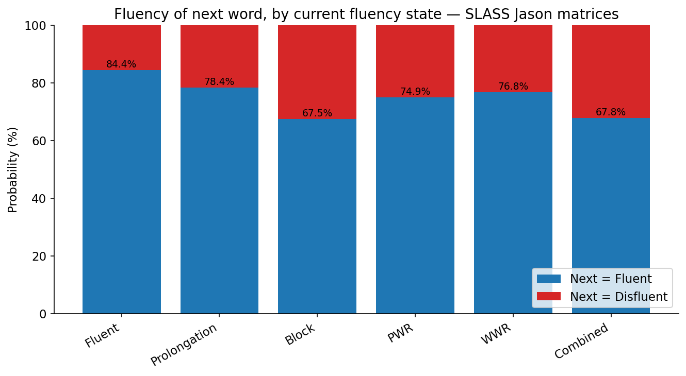

After a fluent word, 85.3% of following words are also fluent. After
any disfluent word, the probability of the next word being fluent
drops:

| Current word | P(next = fluent) |
| ------------- | ---------------- |
| Fluent | 85.3% |
| Prolongation | 80.1% |
| WWR | 78.4% |
| PWR | 76.0% |
| Combined | 69.3% |
| Block | 68.1% |

Blocks and combined disfluencies create the most sustained
disruptions, with only 68–69% recovery to fluency on the next word.
This has direct implications for ASR: blocks create extended
non-standard input sequences that are the most likely to cause
cascading errors.

### Disfluency-to-disfluency transitions

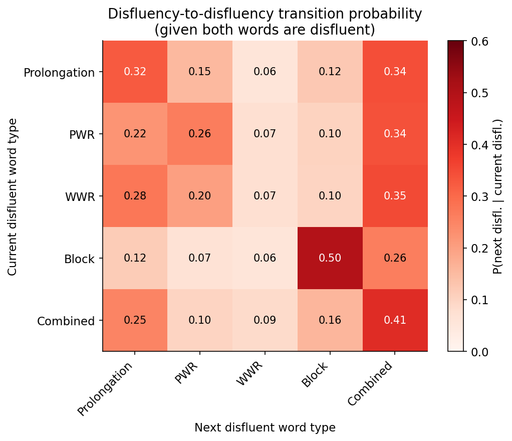

When both current and next word are disfluent, the conditional
transition probabilities reveal which disfluency types tend to follow
each other.

---

## 9. Stutter Clustering

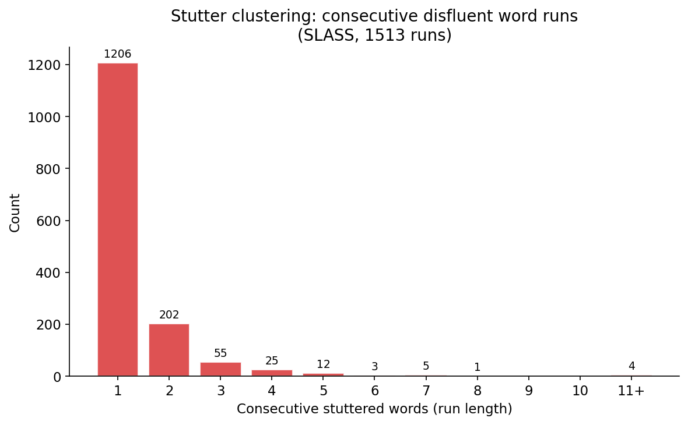

Run-length distribution of consecutive disfluent words (n = 1,513
total runs):

| Run length | Count | Proportion |
| ---------- | ----- | ---------- |
| 1 word (isolated) | 1,206 | 79.7% |
| 2 words | 202 | 13.4% |
| 3 words | 55 | 3.6% |
| 4 words | 25 | 1.7% |
| 5+ words | 25 | 1.7% |

The majority (79.7%) of disfluency events are isolated single words
followed by fluent speech. 20.3% of events occur in clusters of two
or more consecutive disfluent words. These clusters are particularly
relevant for ASR because they represent sustained periods of
non-standard acoustic input where model errors are most likely to
compound.

This is the per-word run-length result; it does not contradict the
co-occurrence analysis in §7, which counts multiple disfluency types
*within a single word*. The two together say: most disfluent moments
are single-word events, but those single words frequently carry
multiple overlapping disfluency mechanisms (35% of stuttered words
carry two or more types).

Pete's comparison with Yairi's clustering claim is worth pursuing
once we can stratify by event type (e.g. block runs separately from
prolongation runs).

---

## 10. Implications for ASR Evaluation

1. **Duration-based failure modes.** Disfluent words are 2–5× longer
   than fluent words. ASR models with aggressive endpointing may
   truncate stuttered words.
2. **Block persistence.** Blocks are the most persistent disfluency
   type (15.8% self-transition). ASR systems will encounter sustained
   sequences of blocked speech that create extended silence or
   non-standard input, likely triggering hallucinations or segment
   abandonment.
3. **Ordered co-occurrence within words.** 35% of stuttered words
   involve multiple simultaneous types, with Prolongation → PWR (292)
   the dominant ordering. These compound events create acoustic signals
   that deviate from expected patterns in multiple ways
   simultaneously. The dominant Prolongation → PWR ordering may
   interact specifically with the decoder's expectation of stable
   sub-phoneme content.
4. **Function-word vulnerability.** High-frequency function words
   stutter at 14.2%, potentially confusing language model priors that
   expect these words to be produced fluently. WWR in particular is
   concentrated at short function words.
5. **Clustering effects.** 20.3% of disfluency events occur in
   clusters of 2+ consecutive words. Co-dependency analysis should
   examine whether ASR error rates are elevated within these clusters
   compared to isolated disfluencies.
6. **Syllable complexity confound.** Longer words stutter more (15.7%
   for 1-syllable to 31.7% for 4-syllable) and may also produce more
   ASR errors on fluent speech. Analyses must control for word
   complexity. The newly added stutter-type × syllable breakdown
   shows the composition of stutter-types shifts toward Combined and
   away from WWR as syllable count climbs.
7. **Type-specific ASR failure modes.** Each disfluency type has a
   distinct acoustic profile (Prolongation = extended formant, Block =
   silence, PWR = rapid sub-word repetition, WWR = whole-word
   repetition) and likely interacts differently with encoder and
   decoder components.

---

## Outstanding follow-ups

- **For Jason:** manner-class breakdown of the dominant ordered
  co-occurrences (Prolongation → PWR; Block → Prolongation; Block →
  PWR) per the IJCLD manner paper, as discussed in
  `responses_3_to_pete.md`.
- **For the project:** master-roster join for the 8,839 SLASS sessions
  with opaque filenames (egress manifest is ready, awaits DPO sign-off
  before the Windows-side egress run).
- **For ASR analysis:** persistence half-life and manner-conditioned
  persistence tests (Pete page 14).
- **UNWR forced alignment:** per-word durations would let UNWR
  contribute to the cross-dataset duration KDE. Currently UNWR sits
  outside that figure because we have transcripts but no time
  alignment.
- **UNWR Reliability data (children's nonword reading):** parsed into
  `/Volumes/FATSPEECH/unwr_reliability/processed/items.csv` with
  inter-rater agreement computed (gold-standard PER ≈ 5%, naive
  retranscriber PER ≈ 25%). Held pending arrival of the corresponding
  audio recordings — see `data/unwr_reliability.md` for status.
